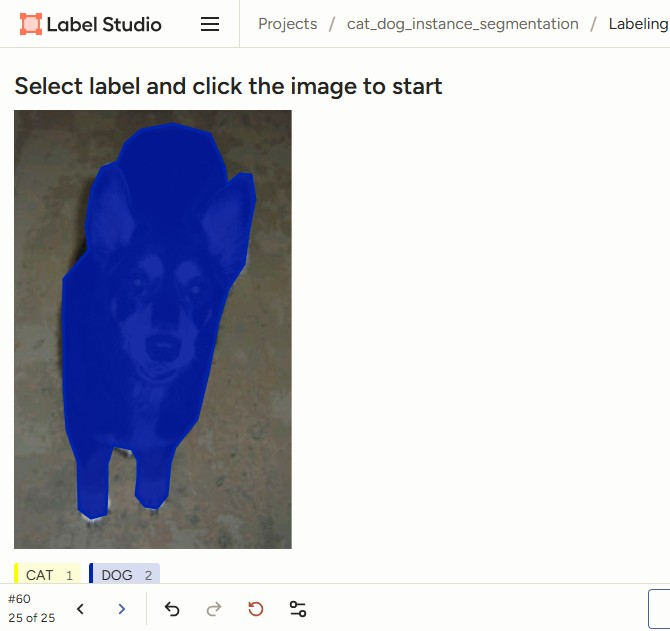
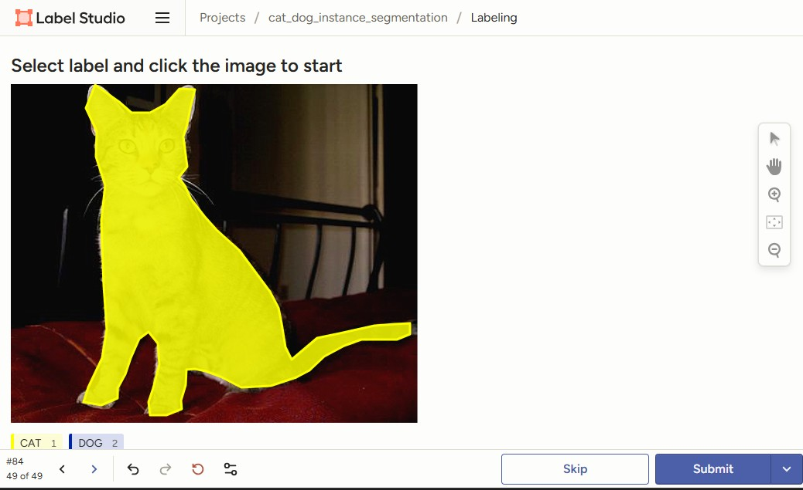
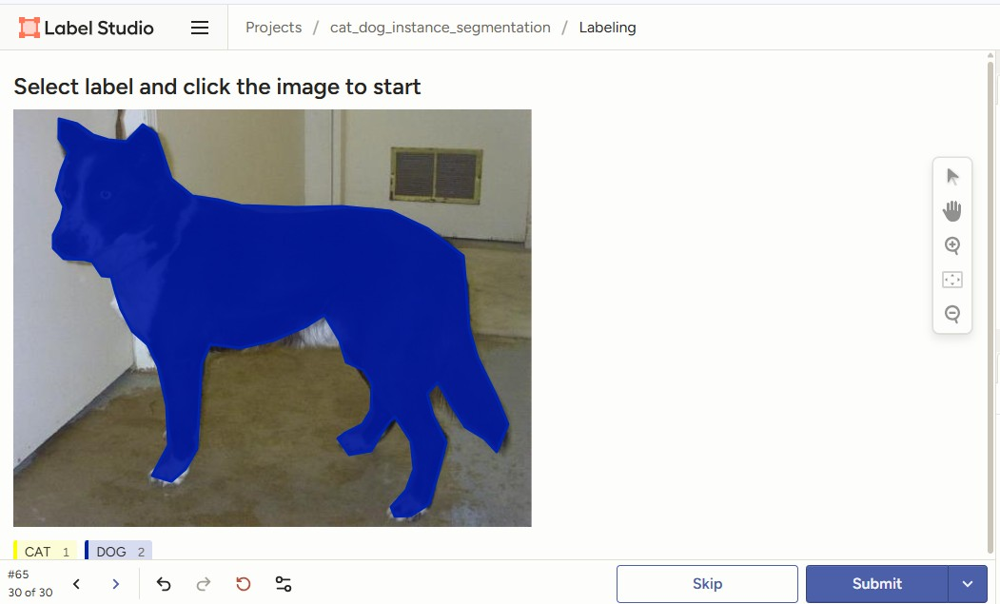
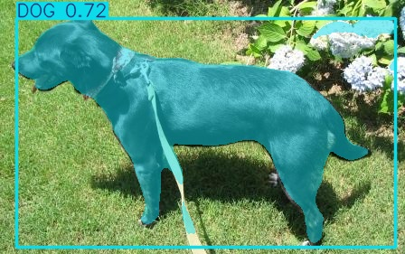
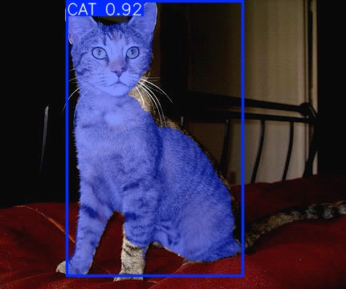
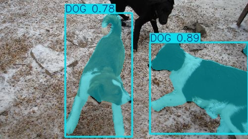

# Cat and Dog Image Segmentation using YOLO11

This is a simple image segmentation project using YOLO11 segmentation models to detect and segment cats and dogs from images and videos.

The project was trained on a custom annotated dataset based on the Kaggle Cats and Dogs dataset.

---

# Dataset

Dataset used: (I used small set of images)

https://www.kaggle.com/datasets/bhavikjikadara/dog-and-cat-classification-dataset

Classes:

- Cat
- Dog

---

# Annotation

The dataset annotations were created using Label Studio for segmentation mask annotation.

## Annotation Examples

### Example 1



### Example 2



### Example 3



---

# Project Structure

```text
instance-segmentation-yollo11/
│
├── runs/
├── train/
│   ├── images/
│   └── labels/
│
├── val/
│   ├── images/
│   └── labels/
│
├── custom-dataset.yaml
├── train.py
├── predict.py
│
├── yolo11n-seg.pt
├── yolov11_seg_custom.pt
```

---

# Technologies Used

- Python
- PyTorch
- Ultralytics YOLO11
- OpenCV
- Label Studio

---

# Training

Train the segmentation model using:

```bash
python train.py
```

Training script:

```python
from ultralytics import YOLO

# Load a pretrained segmentation model
model = YOLO('yolo11n-seg.pt')

# Train the model
model.train(
    data='custom-dataset.yaml',
    epochs=100,
    imgsz=640,
    batch=8,
    device='cpu'
)
```

---

# Custom Trained Model

The trained segmentation model:

```text
yolov11_seg_custom.pt
```

---

# Training Results

Model evaluation results on the validation dataset:

| Class | Precision | Recall | mAP50 | mAP50-95 |
| ----- | --------- | ------ | ----- | -------- |
| CAT   | 1.000     | 0.874  | 0.995 | 0.648    |
| DOG   | 0.414     | 1.000  | 0.903 | 0.811    |
| ALL   | 0.707     | 0.937  | 0.949 | 0.730    |

---

# Validation Metrics

- Overall mAP50: **0.949**
- Overall mAP50-95: **0.730**
- Segmentation model: **YOLO11n-seg**
- Training device: **CPU**
- Epochs: **100**

---

# Prediction / Inference

Run prediction on images or videos:

```bash
python predict.py
```

Prediction example:

```python
model.predict(
    source='D:/2026/Developing/ml_projects/instance-segmentation-yollo11/1.jpg',
    show=False,
    save=True,
    conf=0.5,
    line_width=2,
    show_labels=True,
    show_conf=True,
    save_txt=False,
    device='cpu',
    classes=[0, 1]
)
```

# Segmentation Results

## Prediction Example 1



---

## Prediction Example 2



---

## Prediction Example 3



---

# Installation

Clone the repository:

```bash
git clone https://github.com/Asmaathabet/Cat-and-Dog-Image-Segmentation.git

```

Install dependencies:

```bash
pip install ultralytics opencv-python
```

---

# Notes

- This project is a simple practice/sample project for learning YOLO11 image segmentation.
- The model was trained on a small custom annotated dataset.
- Results can improve with larger datasets and longer training.

---

# Future Improvements

- Improve segmentation accuracy
- Add more animal classes
- Real-time webcam segmentation
- Deploy on mobile applications
- Export to ONNX / TensorRT

---
